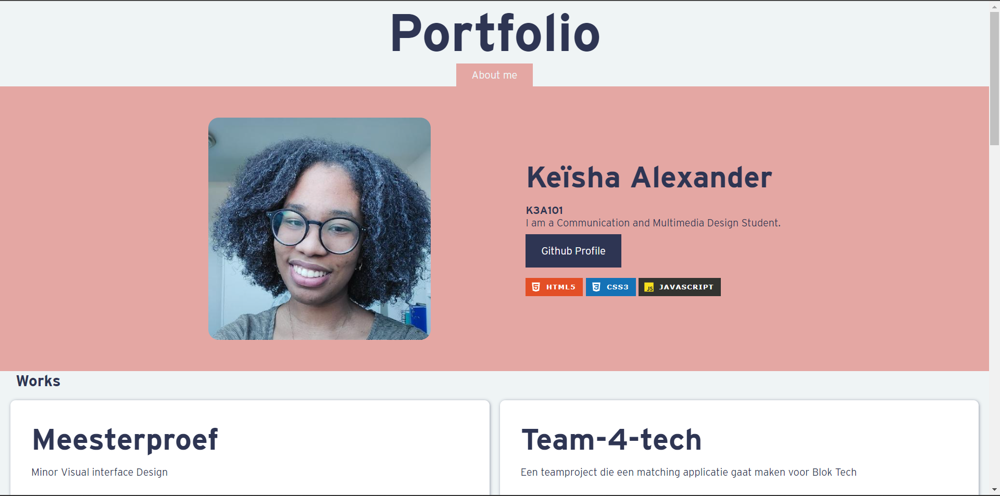

# Github portfolio
Mijn portfolio is een onepage single page application. Het bestaat namelijk uit mijn persoonlijke gegevens en mijn projecten. Ik heb mijn portfolio gemaakt met vanilla HTML, CSS en JavaScript. Verder heb ik de Github API gebruikt om het data van mijn Github account te gebruiken als inhoud. De inhoud in mijn portfolio zijn mijn persoonlijke gegevens, mijn gepinde repositories en details van mijn repository. 




## Inhoud
- [Concept]()
- [Het Proces]()
- [Opdracht]()
- [Eisen voor portfolio]()
- [Ideegeneratie]()
- [Github API]()
- [Fetch data]()
- [Render data]()
- [Bronnen]()


--- 
# Het Proces
## Opdracht
In de project week  ga ik de kennis van CSS to the rescue  en Web App from scratch toepassen in het project. Voor het project ga ik een portfolio maken met de Github API. In de github API staan alle informatie van mijn github account bijvoorbeeld mijn repositories. Mijn portfolio moet een singlepage met verschillende "webpagina's". 

## Eisen voor portfolio
### Functionaliteiten
- [x] Fetch data uit Github API
- [x] Overzicht van al mijn repositories
- [x] Details van de repository zoals  link naar readme, link naar live demo en de gebruikte programeer talen.
- [ ] Thumbnail van de live demos
- [x] Progressive disclosure om meer informatie zichtbaar laten maken als je op mijn gebruikersnaam of button klikt 
- [ ] Loading state
- [ ] Geanimeerde Navigatie menu met haschange event
- [ ] 

### Portfolio inhoud
- [x] Mijn github gebruikersnaam
- [x] Mijn github profiel foto
- [x] Korte beschrijving over de soort ontwerper die ik ben 
- [x] Mijn repositories
- [ ] Programeertalen die ik ken
- [ ] Afbeelding toevoegen bij de Repository

### CSS Technieken
- [ ] Scroll-snap
- [x] has() selector
- [ ] 3D Transform animatie
- [x] Transform-property

---

## Ideegeneratie 
Vervolgens heb ik wat inspiratie opgedaan op de manier hoe mijn portfolio eruit gaat zien. Ik heb verschillende schetsen gemaakt voor mobe versie als desktop versie. Toen ik de schets maken was ik heel erg ambitieus. Maar ik kon ze niet implementeren want ik had niet genoeg tijd daarvoor om alles te doen die ik wilde doen. Dus nu lijk het een beetje simpel. 

### Schets 1


### Schets 2


### Schets 3


### Schets 4


### Schets 5 


Uiteindelijk heb ik een schets 6 gekozen die ik veder ging uitwerken. 
### Schets 6 


---
## Code achter dit project 
### Github API
Om de data voor mijn portfolio te halen heb ik de REST API van github gebruikt. Met behulp van de API [documentaie](https://docs.github.com/en/rest?apiVersion=2022-11-28) kon ik de API in mij project inmplementeren.  

De API zelf bestaat van verschillende endpoint dus je kan veel soorten data ophalen. Wat ik heb gebruikt is de een repository lijst van een gebruiker en account gegevens. 
De links zien zo uit:
```
<!-- Persoonlijke gegevens van een gebruiker -->
https://api.github.com/users/${username}

<!-- Lijst van repository van een specifieke gebruiker -->
https://api.github.com/users/${username}/repos

<!-- Details per repository -->
https://api.github.com/repos/${username}/${repo-name}
```

In mijn javascript bestaand heb ik de API opgesplits in variabele zodat ik later kan ik herbruiker als ik in de toekomst een nieuwe fetch gaat doen. Deze variabele is te vinden in `variabele.js` bestand.

```javascript
//variabele.js
 const API_URL = "https://api.github.com";
 const username = "K3A101";

// fetc-repo.js
fetch(`${API_URL}/users/${username}/repos`)

```
### Fetch data
Om de data op te halen heb ik de `fetch()` mwthode gebruikt. Ik heb tot nu toe twee fetches gedaan. Een fetch om mijn favoriete repositories op te halen. De andere fetch is om mijn data van mijn github profiel.

 #### Repo Data die ik heb opgehaald:
- Repository naam
- Repo beschrijving
- Link naar github pages
- link naar de Repo zelf
- Meest geschreven programeertaal

```javascript
import { API_URL, username, repoList } from "./variabele.js";
import { displayRepoData, languageColorCode } from "./render.js";

export function fetchRepoData() {
    fetch(`${API_URL}/users/${username}/repos`)
        .then((response) => response.json())
        .then((repos) => {
            repos.forEach(repo => {
                const repoName = repo.name;
                const repoDescription = repo.description;
                const githubPages = repo.homepage;
                const starredRepo = repo.stargazers_count;
                const programmingLanguage = repo.language;
                const repoLink = repo.html_url
                
                if (starredRepo != 0) {
                    const REPO_DOCS_URL = `${API_URL}/repos/${username}/${repoName}/readme`
                    fetch(REPO_DOCS_URL)
                        .then((response) => response.json())
                        .then((readmes) => {
                            const readmePage = readmes.html_url;
                            let repoElement = displayRepoData(repoName, repoDescription, githubPages, repoLink, programmingLanguage)
                            languageColorCode(programmingLanguage)
                            repoList.insertAdjacentHTML('beforeend', repoElement);
                        })
                        .catch((error) => { console.error(error) });

                }
            });

        })
        .catch((error) => { console.error(error) });
}

```

#### Gebruiker data:
- Eigen naam
- Gebruikersnaam
- Bio
- Github Avatar

```javascript
// fetch-user.js
import { API_URL, username } from "./variabele.js";
import { displayUserData } from "./render.js";

export function fetchUserData() {
    fetch(`${API_URL}/users/${username}`)
        .then((response) => response.json())
        .then((user) => {
            console.log(user);
            displayUserData(user)
        })
        .catch((error) => {
            console.error(error)
        })
}

```
### Render data
Data is opgehaald en moet nu zichtbaar zijn in dom.
Hiermee heb ik template literals gebruikt en HTML daarin geschreven. Ik heb een aparte functie gemaakt voor de twee fetches, `displayRepoData()` en `displayUserData()` Beide functies zijn geroepen in de fetch functie. 

### Repo 
```javascript
// Render.js
function displayRepoData(repoName, repoDescription, githubPages, repoLink, programmingLanguage) {
    return `
             <article>
                <h1>${repoName}</h1>
                <p>${repoDescription}</p>
                  <ul>
                    <li>${programmingLanguage}</li>
                    <li><a href="${githubPages}">Demo</a></li>
                    <li><a href="${repoLink}">README</a></li>
                 </ul>           
             </article>
             `;

}

// fetch-repo-data.js
const repoName = repo.name;
const repoDescription = repo.description;
const githubPages = repo.homepage;
const starredRepo = repo.stargazers_count;
const programmingLanguage = repo.language;
const repoLink = repo.html_url
// De functie wordt in de repoElement variabele opgeslagen

 let repoElement = displayRepoData(repoName, repoDescription, githubPages, repoLink, programmingLanguage)


```

### Gebruiker

```javascript
function displayUserData(user) {
    let userHTML = ``
    userHTML = `
    
          <article>
                
                <div>
                    <p>${user.name}</p>
                    <p>${user.login}</p>
                    <p>${user.bio}</p>
                    <a href="${user.html_url}">Github Profile</a>
                    <figure>
                        
                        
                        
                    </figure>
                </div>              
            </article>
           
           
    `;
    userSection.insertAdjacentHTML('beforeend', userHTML)

}

```

---

## Bronnen


